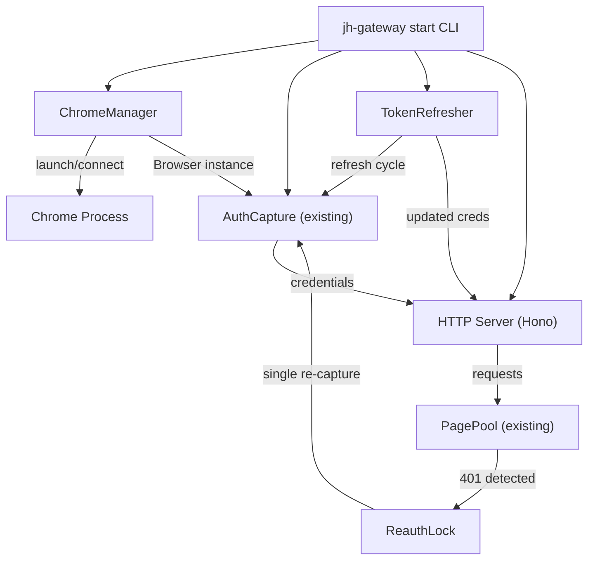
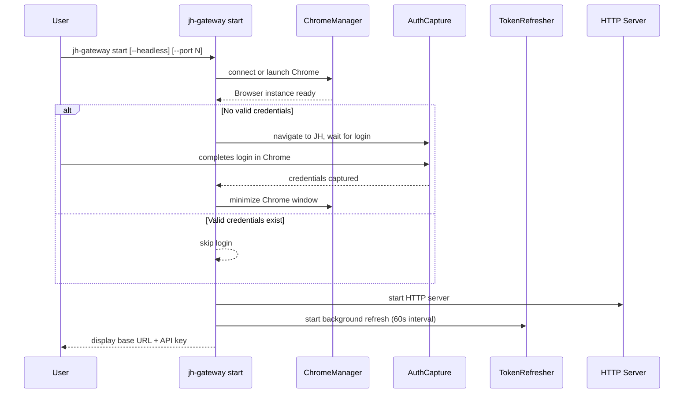

# Design Document: Auto-Auth and Managed Chrome

## Overview

This feature transforms the jh-web-gateway from a multi-terminal, manually-orchestrated workflow into a single-command experience. Today, users must: (1) launch Chrome with `--remote-debugging-port` in one terminal, (2) run `jh-gateway auth` to capture credentials, and (3) run `jh-gateway serve` to start the server. Tokens expire silently, causing 401 failures that require manual re-auth.

The new `jh-gateway start` command orchestrates the entire lifecycle: it launches Chrome (or connects to an existing instance), opens the JH login page, waits for the user to sign in once, minimizes Chrome, starts the HTTP server, and proactively refreshes tokens before they expire. Existing commands (`setup`, `serve`, `auth`) remain fully functional for users who prefer the manual workflow.

### Key Design Decisions

1. **Chrome process ownership tracking**: The Chrome_Manager tracks whether it launched Chrome or connected to an existing instance. Only self-launched Chrome processes are terminated on shutdown.
2. **Single re-capture lock**: When a 401 triggers credential re-capture, a deduplication lock ensures only one re-capture runs at a time. Concurrent 401s queue behind the same lock and share the result.
3. **Non-disruptive token refresh**: The Token_Refresher operates on a background interval, updating credentials atomically so in-flight requests continue with the old token until the new one is ready.
4. **Headless mode via `--headless`**: Supports fully headless Chrome for CI/server environments where no display is available.

## Architecture



### Startup Sequence



## Components and Interfaces

### 1. ChromeManager (`src/infra/chrome-manager.ts`)

Responsible for launching, connecting to, and managing the Chrome browser process lifecycle.

```typescript
interface ChromeManagerOptions {
  cdpPort?: number;           // default: 9222
  headless?: boolean;         // default: false
  userDataDir?: string;       // default: ~/.jh-gateway/chrome-profile
}

interface ChromeManagerState {
  browser: Browser;
  selfLaunched: boolean;      // true if we spawned the process
  process?: ChildProcess;     // only set if selfLaunched
}

class ChromeManager {
  constructor(options?: ChromeManagerOptions);

  /** Try connecting to existing Chrome, or launch a new one */
  connect(): Promise<ChromeManagerState>;

  /** Detect Chrome executable path for current OS */
  static findChromePath(): string | null;

  /** Terminate managed Chrome (only if selfLaunched) */
  async shutdown(state: ChromeManagerState): Promise<void>;

  /** Attempt to relaunch after crash (up to 30s) */
  async reconnect(state: ChromeManagerState): Promise<ChromeManagerState>;

  /** Minimize the Chrome window via CDP */
  async minimizeWindow(state: ChromeManagerState): Promise<void>;
}
```

**OS-specific Chrome paths:**
- macOS: `/Applications/Google Chrome.app/Contents/MacOS/Google Chrome`
- Linux: `google-chrome`, `google-chrome-stable`, `chromium-browser`, `chromium` (searched via `which`)
- Windows: `C:\Program Files\Google\Chrome\Application\chrome.exe`, `C:\Program Files (x86)\Google\Chrome\Application\chrome.exe`

**Launch flags:**
```
--remote-debugging-port=<port>
--user-data-dir=<userDataDir>
--no-first-run
--no-default-browser-check
[--headless=new]  // only when headless mode requested
```

### 2. TokenRefresher (`src/core/token-refresher.ts`)

Background service that monitors JWT expiry and proactively re-captures credentials.

```typescript
interface TokenRefresherOptions {
  checkIntervalMs?: number;    // default: 60_000
  refreshBeforeExpiryMs?: number; // default: 300_000 (5 min)
  maxRetries?: number;         // default: 3
}

interface CredentialHolder {
  get(): GatewayCredentials | null;
  set(creds: GatewayCredentials): void;
}

class TokenRefresher {
  constructor(
    credentialHolder: CredentialHolder,
    cdpUrl: string,
    options?: TokenRefresherOptions,
  );

  /** Start the background check interval */
  start(): void;

  /** Stop the background check interval */
  stop(): void;

  /** Check if a refresh is needed and perform it */
  async checkAndRefresh(): Promise<boolean>;
}
```

### 3. ReauthLock (`src/core/reauth-lock.ts`)

Deduplication mechanism ensuring only one credential re-capture runs at a time when 401s are detected.

```typescript
class ReauthLock {
  /** 
   * Execute a re-capture, or wait for an in-progress one.
   * Returns the refreshed credentials.
   */
  async acquire(
    recaptureFn: () => Promise<GatewayCredentials>
  ): Promise<GatewayCredentials>;
}
```

When the first 401 triggers `acquire()`, it runs `recaptureFn`. Concurrent callers receive the same promise and share the result. After the promise settles, the lock resets for the next failure.

### 4. Unified CLI Command (`src/cli/start.ts`)

The `jh-gateway start` command that orchestrates the full lifecycle.

```typescript
interface StartOptions {
  port?: number;
  pages?: number;
  headless?: boolean;
}

async function runStart(options: StartOptions): Promise<void>;
```

**Phases displayed to user via `@clack/prompts` spinners:**
1. `Connecting to Chrome...` / `Launching Chrome...`
2. `Waiting for login...` (skipped if valid creds exist)
3. `Starting server on port XXXX...`
4. Final summary: base URL + API key

### 5. Modified Existing Components

**`src/cli.ts`** — Add `start` command to the CLI router.

**`src/server.ts`** — Accept a `ReauthLock` in `ServerDeps` so the chat completions route can use it for 401 deduplication.

**`src/infra/config.ts`** — No schema changes needed. New fields (like `chromeManaged`) are not persisted; they are runtime-only state.

**`src/infra/types.ts`** — Add `expiresAt` field to `GatewayCredentials` (optional, for in-memory tracking).

## Data Models

### Configuration (no schema changes)

The existing `GatewayConfig` at `~/.jh-gateway/config.json` remains unchanged. New features use runtime-only state that is not persisted:

```typescript
// Existing — unchanged
interface GatewayConfig {
  cdpUrl: string;
  port: number;
  defaultModel: string;
  defaultEndpoint: string;
  credentials: GatewayCredentials | null;
  auth: { mode: "none" | "bearer" | "basic"; token: string | null };
  maxQueueWaitMs: number;
}
```

### Runtime Credential State

In-memory credential holder used by TokenRefresher and ReauthLock:

```typescript
interface RuntimeCredentials extends GatewayCredentials {
  expiresAt: number;  // JWT exp claim (unix seconds)
}
```

### ChromeManager Internal State

```typescript
interface ManagedChromeState {
  browser: Browser;
  selfLaunched: boolean;
  childProcess?: ChildProcess;
  cdpPort: number;
  userDataDir: string;
}
```


## Correctness Properties

*A property is a characteristic or behavior that should hold true across all valid executions of a system — essentially, a formal statement about what the system should do. Properties serve as the bridge between human-readable specifications and machine-verifiable correctness guarantees.*

### Property 1: Token refresh decision boundary

*For any* current timestamp `now` and JWT expiry timestamp `expiresAt`, the `shouldRefresh(now, expiresAt, thresholdMs)` function SHALL return `true` if and only if `(expiresAt - now) * 1000 < thresholdMs`. This ensures the Token_Refresher triggers refresh exactly when the token is within the configured threshold of expiry, and not otherwise.

**Validates: Requirements 3.2**

### Property 2: Credential holder read consistency

*For any* sequence of interleaved `get()` and `set(creds)` operations on the CredentialHolder, a `get()` call SHALL never return `null` once credentials have been set, and SHALL never return a partially-constructed credential object. Every `get()` returns either the most recently completed `set()` value or the previous value if a `set()` is in progress.

**Validates: Requirements 3.6**

### Property 3: Exactly-once 401 retry per request

*For any* API request that receives a 401 response from the JH platform and where credential re-capture succeeds, the Gateway SHALL retry that request exactly once with the refreshed credentials. The total number of attempts for any single client request SHALL be at most 2 (original + one retry).

**Validates: Requirements 6.2**

### Property 4: ReauthLock deduplication

*For any* number N of concurrent `acquire()` calls on the ReauthLock, the provided `recaptureFn` SHALL be invoked exactly once, and all N callers SHALL receive the same resolved credentials. After the promise settles, a subsequent `acquire()` call SHALL invoke `recaptureFn` again (the lock resets).

**Validates: Requirements 6.4**

### Property 5: Config backward compatibility with default filling

*For any* valid existing `GatewayConfig` JSON object (conforming to the current schema), loading that config through `loadConfig()` SHALL succeed and return a valid `GatewayConfig` with all required fields populated. Fields absent from the JSON SHALL be filled with their default values.

**Validates: Requirements 7.2, 7.3**

## Error Handling

### Chrome Launch Failures

| Scenario | Behavior |
|---|---|
| Chrome executable not found | Display error listing expected paths for the detected OS. Exit with code 1. |
| CDP port already in use (by non-Chrome) | Attempt connection first; if it fails CDP handshake, display error suggesting a different port. |
| Chrome crashes during operation | ChromeManager attempts reconnect within 30s. If reconnect fails, log error and continue (server stays up but requests will fail). |
| Chrome process exits unexpectedly | Same as crash — trigger reconnect flow. |

### Authentication Failures

| Scenario | Behavior |
|---|---|
| Login timeout (300s) | Display timeout message, terminate Chrome if self-launched, exit with code 1. |
| Token refresh fails (single attempt) | Retry up to 3 times with exponential backoff (5s, 15s, 30s). |
| Token refresh fails (all 3 retries) | Log warning, continue with current credentials. Next interval check will retry. |
| 401 during request + re-capture fails | Return 401 to client with descriptive message. |

### Server Errors

| Scenario | Behavior |
|---|---|
| Port already in use | Display error with the conflicting port number. Exit with code 1. |
| Graceful shutdown (SIGINT/SIGTERM) | Drain in-flight requests (10s timeout), stop TokenRefresher, terminate managed Chrome, exit cleanly. |

### ReauthLock Edge Cases

| Scenario | Behavior |
|---|---|
| Re-capture promise rejects | All queued callers receive the rejection. Lock resets for next attempt. |
| Re-capture hangs | Callers should implement their own timeout (e.g., 30s). The lock itself does not enforce a timeout. |

## Testing Strategy

### Unit Tests (example-based)

Unit tests cover specific scenarios, edge cases, and integration points:

- **ChromeManager.findChromePath()**: Mock `process.platform` for macOS/Linux/Windows, verify correct paths returned (Req 1.3)
- **ChromeManager connect vs launch**: Mock CDP availability, verify correct path taken (Req 1.2)
- **ChromeManager shutdown**: Verify process.kill called only when selfLaunched=true (Req 1.4, 1.5)
- **ChromeManager error on missing Chrome**: Verify descriptive error when no executable found (Req 1.6)
- **Auth skip when valid creds exist**: Mock non-expired credentials, verify login step skipped (Req 2.3)
- **Auth timeout**: Mock captureCredentials timeout, verify error message and exit (Req 2.4)
- **TokenRefresher interval**: Use fake timers, verify checkAndRefresh called every 60s (Req 3.1)
- **TokenRefresher retry exhaustion**: Mock 3 consecutive failures, verify warning logged (Req 3.5)
- **CLI flag parsing**: Verify --headless, --port, --pages flags are correctly parsed and forwarded (Req 4.2, 4.3, 4.4)
- **Backward compatibility smoke**: Verify setup, serve, auth commands still registered (Req 7.1)

### Property-Based Tests (fast-check)

Property tests use the `fast-check` library (already in devDependencies) with minimum 100 iterations per property. Each test is tagged with its design property reference.

| Property | Test Description | Generator Strategy |
|---|---|---|
| Property 1: Token refresh decision | Generate random `(now, expiresAt, thresholdMs)` tuples. Verify `shouldRefresh` returns true iff within threshold. | `fc.integer()` for timestamps, `fc.integer({min: 1000, max: 600_000})` for threshold |
| Property 2: Credential holder consistency | Generate random sequences of get/set operations with random credential payloads. Verify get never returns null after first set. | `fc.array(fc.oneof(fc.constant('get'), fc.record({...})))` |
| Property 3: Exactly-once retry | Generate random request counts (1-20) that all receive 401. Verify each is retried exactly once. | `fc.integer({min: 1, max: 20})` for concurrent request count |
| Property 4: ReauthLock deduplication | Generate random concurrency levels (2-50). Fire N concurrent acquire() calls. Verify recaptureFn called exactly once. | `fc.integer({min: 2, max: 50})` for N |
| Property 5: Config backward compat | Generate random valid GatewayConfig objects, serialize to JSON, remove random subsets of optional fields, load and verify defaults filled. | `fc.record(...)` matching GatewayConfig shape |

### Integration Tests

- **Full startup sequence**: Mock Chrome process and CDP, verify phases execute in order (Req 4.1)
- **Post-login minimize**: Mock CDP session, verify minimize command sent after auth capture (Req 5.1)
- **401 retry with real server**: Use Hono test client, mock upstream 401 then 200, verify transparent retry (Req 6.1)
- **Credential persistence after refresh**: Mock re-capture, verify both in-memory and config file updated (Req 3.3)

### Test Configuration

```typescript
// vitest.config.ts — no changes needed, existing config covers src/**/*.test.ts
// fast-check is already in devDependencies

// Property test tag format:
// Feature: auto-auth-and-managed-chrome, Property N: <property_text>
```
