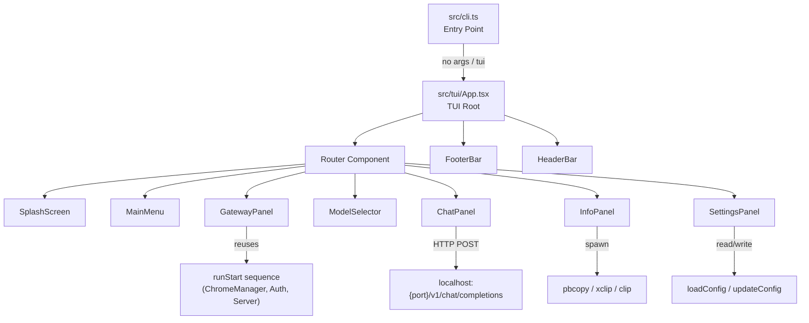
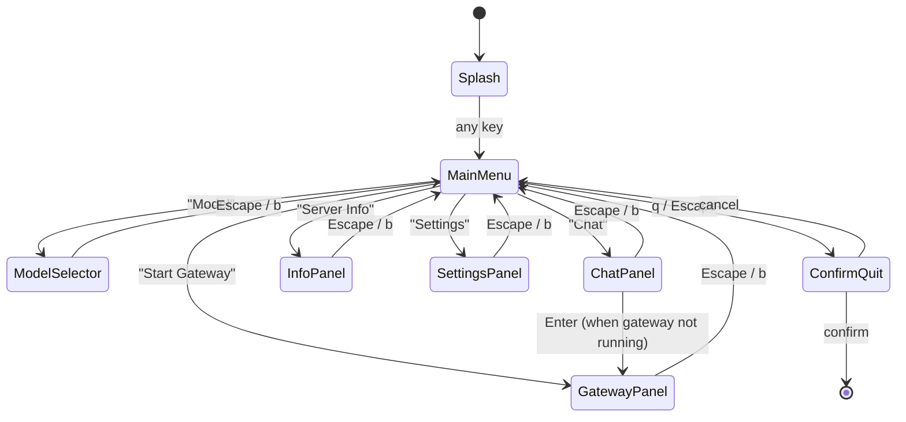

# Design Document: Enhanced TUI

## Overview

This feature replaces the current `jh-gateway` help-text-on-no-args behavior with a full-screen interactive Terminal User Interface (TUI). The TUI provides a unified experience for starting the gateway, selecting models, sending test chat messages, viewing server info, and editing settings — all navigable with arrow keys and single-keystroke shortcuts.

The TUI is built with [Ink](https://github.com/vadimdemedes/ink), a React-based terminal UI library for Node.js. Ink provides component-based rendering, flexbox layout via Yoga, alternate screen buffer support, and a rich ecosystem of input/text components. This aligns well with the project's TypeScript stack and avoids the maintenance burden of raw ANSI escape sequences.

### Key Design Decisions

1. **Ink over blessed/raw ANSI**: Ink is actively maintained, TypeScript-friendly, and uses a React component model that makes state management and panel transitions straightforward. `blessed` is unmaintained since 2015.
2. **Panel-based navigation with a router**: A lightweight router component manages which panel is active. Each panel is an independent React component that receives shared app state via context.
3. **Gateway lifecycle reuse**: The TUI reuses the existing `runStart` startup sequence (ChromeManager, AuthCapture, PagePool, TokenRefresher) but wraps it in a non-blocking async flow that reports progress to the TUI instead of using `@clack/prompts` spinners.
4. **Chat via local HTTP**: The Chat panel sends requests to the local gateway HTTP endpoint (`/v1/chat/completions`), treating the TUI as a client of its own server. This avoids duplicating the request pipeline and ensures the chat experience matches what external clients see.
5. **Clipboard via native commands**: Uses `pbcopy` (macOS), `xclip`/`xsel` (Linux), or `clip` (Windows) via child process spawn, with graceful fallback to displaying text in a copyable box.
6. **No-args launches TUI**: `jh-gateway` with no arguments now launches the TUI instead of printing help. The `tui` subcommand is an alias. All existing subcommands remain unchanged.

## Architecture



### Panel Navigation Flow



## Components and Interfaces

### 1. TUI Entry Point (`src/tui/index.ts`)

Bootstraps the Ink app with alternate screen buffer and raw mode.

```typescript
export async function launchTui(): Promise<void>;
```

Called from `src/cli.ts` when no command is provided or when `tui` is the command. Uses `render()` from Ink with `{ exitOnCtrlC: false }` so we can handle Ctrl+C ourselves for graceful shutdown.

### 2. App Root (`src/tui/App.tsx`)

Top-level component that provides shared state context and renders the layout.

```typescript
interface AppState {
  currentPanel: PanelId;
  gatewayStatus: "stopped" | "starting" | "running" | "error";
  gatewayError: string | null;
  activeModel: string;
  config: GatewayConfig;
  serverHandle: ServerHandle | null;
  chromeState: ChromeManagerState | null;
}

type PanelId = "splash" | "menu" | "gateway" | "model" | "chat" | "info" | "settings";
```

Layout structure:
- **HeaderBar** (1 line): app name + gateway status indicator
- **Content area** (flex-grow): active panel
- **FooterBar** (1 line): context-sensitive keyboard shortcuts

### 3. SplashScreen (`src/tui/panels/SplashScreen.tsx`)

Renders ASCII-art JHU logo with a character-reveal animation.

```typescript
interface SplashScreenProps {
  onComplete: () => void;
}
```

- Uses `useEffect` + `setInterval` to reveal characters over 1500–2500ms
- Tracks `animationComplete` state; any keypress during animation sets it to true
- After animation, shows "Press any key to continue"
- Any keypress after animation calls `onComplete`

### 4. MainMenu (`src/tui/panels/MainMenu.tsx`)

Arrow-key navigable list with inline help descriptions.

```typescript
interface MenuItem {
  id: PanelId;
  label: string;
  description: string;
}

const MENU_ITEMS: MenuItem[] = [
  { id: "gateway", label: "Start Gateway", description: "Launch Chrome, authenticate, and start the HTTP server" },
  { id: "model", label: "Model", description: "Select the active AI model" },
  { id: "chat", label: "Chat", description: "Send a test message to the running gateway" },
  { id: "info", label: "Server Info", description: "View and copy the server URL and API key" },
  { id: "settings", label: "Settings", description: "View and edit gateway configuration" },
  { id: "quit", label: "Quit", description: "Exit jh-gateway" },
];
```

- `useInput` hook from Ink for arrow keys and Enter
- Wrapping navigation (last → first, first → last)
- `q` or Escape triggers quit confirmation

### 5. GatewayPanel (`src/tui/panels/GatewayPanel.tsx`)

Manages the gateway lifecycle with live status updates.

```typescript
interface GatewayPhase {
  label: string;
  status: "pending" | "active" | "done" | "error";
}
```

Phases: "Connecting to Chrome" → "Waiting for login" → "Starting server"

The panel calls a `startGateway()` function that mirrors `runStart` but:
- Reports progress via React state updates instead of `@clack/prompts` spinners
- Stores the `ServerHandle`, `ChromeManagerState`, and `TokenRefresher` in app context
- Does not register its own SIGINT/SIGTERM handlers (the TUI root handles those)

### 6. ModelSelector (`src/tui/panels/ModelSelector.tsx`)

Navigable list of models from `MODEL_ENDPOINT_MAP`.

```typescript
interface ModelSelectorProps {
  models: string[];
  activeModel: string;
  onSelect: (model: string) => void;
  onBack: () => void;
}
```

- Highlights current model with a distinct marker (e.g., `●` vs `○`)
- Enter persists selection via `updateConfig({ defaultModel: selected })`
- Shows brief confirmation toast on selection

### 7. ChatPanel (`src/tui/panels/ChatPanel.tsx`)

Single-turn chat interface that talks to the local gateway.

```typescript
interface ChatPanelProps {
  gatewayRunning: boolean;
  port: number;
  apiKey: string | null;
  model: string;
  onNavigateToGateway: () => void;
  onBack: () => void;
}
```

When `gatewayRunning` is false:
- Displays: "Gateway is not running. Press Enter to start it."
- Enter navigates to GatewayPanel via `onNavigateToGateway`

When `gatewayRunning` is true:
- Text input field at bottom, response area above
- On Enter: POST to `http://127.0.0.1:{port}/v1/chat/completions` with `{ model, messages: [{ role: "user", content: input }] }` and `Authorization: Bearer {apiKey}`
- Shows spinner during request
- Displays response text; clears input for next message
- Each submission is independent (no conversation history)

### 8. InfoPanel (`src/tui/panels/InfoPanel.tsx`)

Displays server connection details with copy shortcuts.

```typescript
interface InfoPanelProps {
  port: number;
  apiKey: string | null;
  gatewayRunning: boolean;
  onBack: () => void;
}
```

- Shows base URL and API key in a bordered box
- `c` copies URL, `k` copies API key via `copyToClipboard()`
- Brief "Copied!" flash message (1.5s timeout)
- If clipboard unavailable, shows text in a selectable format

### 9. SettingsPanel (`src/tui/panels/SettingsPanel.tsx`)

Editable config fields with inline validation.

```typescript
interface SettingField {
  key: keyof GatewayConfig;
  label: string;
  value: string;
  editable: boolean;
}
```

Editable fields: `port`, `cdpUrl`, `defaultModel`, `auth.mode`
- Arrow keys to navigate fields
- Enter to start editing; Enter again to confirm
- Validates via `validateConfig` rules; shows inline error on failure
- Persists via `updateConfig()`

### 10. HeaderBar (`src/tui/components/HeaderBar.tsx`)

Persistent 1-line header.

```
 jh-gateway                                    ● Gateway: running
```

- Left: app name
- Right: gateway status with colored indicator (green=running, red=stopped, yellow=starting)

### 11. FooterBar (`src/tui/components/FooterBar.tsx`)

Context-sensitive shortcut hints.

```typescript
interface FooterBarProps {
  shortcuts: Array<{ key: string; label: string }>;
}
```

Rendered as: `[↑↓] Navigate  [Enter] Select  [q] Quit`

### 12. Clipboard Utility (`src/tui/utils/clipboard.ts`)

```typescript
export async function copyToClipboard(text: string): Promise<boolean>;
```

- macOS: `spawn("pbcopy")` and write to stdin
- Linux: `spawn("xclip", ["-selection", "clipboard"])` or `xsel --clipboard --input`
- Windows: `spawn("clip")` and write to stdin
- Returns `false` if the command fails or is unavailable

### 13. Gateway Lifecycle Adapter (`src/tui/services/gateway-lifecycle.ts`)

Wraps the existing startup/shutdown logic for TUI consumption.

```typescript
interface GatewayLifecycleCallbacks {
  onPhase: (phase: string) => void;
  onSuccess: (info: { baseUrl: string; apiKey: string | null }) => void;
  onError: (error: Error) => void;
}

export async function startGatewayForTui(
  config: GatewayConfig,
  callbacks: GatewayLifecycleCallbacks,
): Promise<{
  serverHandle: ServerHandle;
  chromeState: ChromeManagerState;
  tokenRefresher: TokenRefresher;
}>;

export async function stopGateway(
  serverHandle: ServerHandle,
  chromeState: ChromeManagerState,
  tokenRefresher: TokenRefresher,
): Promise<void>;
```

This adapter reuses `ChromeManager`, `captureCredentials`, `PagePool`, `startServer`, and `TokenRefresher` but replaces `@clack/prompts` spinner calls with callback invocations.

## Data Models

### App State (runtime only, not persisted)

```typescript
interface TuiAppState {
  currentPanel: PanelId;
  gatewayStatus: "stopped" | "starting" | "running" | "error";
  gatewayError: string | null;
  activeModel: string;           // from config.defaultModel
  config: GatewayConfig;         // loaded at TUI start
  serverHandle: ServerHandle | null;
  chromeState: ChromeManagerState | null;
  tokenRefresher: TokenRefresher | null;
}
```

### No Config Schema Changes

The TUI reads and writes the existing `GatewayConfig` via `loadConfig()` / `updateConfig()`. No new persisted fields are needed. The `defaultModel` field is already present and used by the Model Selector.

### CLI Routing Change

`src/cli.ts` is modified so that the no-argument case and the `tui` command both call `launchTui()` instead of `printHelp()`:

```typescript
// Before: if (!command) { printHelp(); process.exit(0); }
// After:
if (!command || command === "tui") {
  const { launchTui } = await import("./tui/index.js");
  await launchTui();
} else if (command === "--help" || command === "-h") {
  printHelp();
  process.exit(0);
}
```


## Correctness Properties

*A property is a characteristic or behavior that should hold true across all valid executions of a system — essentially, a formal statement about what the system should do. Properties serve as the bridge between human-readable specifications and machine-verifiable correctness guarantees.*

### Property 1: Wrapping list navigation

*For any* list of N items (N ≥ 1), any starting index `i` (0 ≤ i < N), and any number of Down presses `d` or Up presses `u`, the resulting focused index SHALL equal `(i + d) % N` for Down navigation and `(i - u % N + N) % N` for Up navigation. This applies to both the Main Menu and Model Selector lists.

**Validates: Requirements 3.3, 3.4, 5.3**

### Property 2: Focused item description matches menu data

*For any* focused menu index `i` in the Main Menu, the displayed inline help text SHALL exactly equal the `description` field of `MENU_ITEMS[i]`.

**Validates: Requirements 3.7**

### Property 3: Model selection persistence and confirmation

*For any* model `m` in the Available_Models list, when the user selects `m` in the Model Selector, the system SHALL persist `m` as `Config.defaultModel` via `updateConfig`, and the displayed confirmation message SHALL contain the string `m`.

**Validates: Requirements 5.4, 5.5**

### Property 4: Stateless chat request construction

*For any* non-empty user message string `msg` and any active model `m`, the Chat Panel SHALL construct a POST request body where `messages` contains exactly one entry `{ role: "user", content: msg }`, the `model` field equals `m`, and no prior conversation messages are included — regardless of how many previous messages have been sent in the session.

**Validates: Requirements 6.3, 6.7**

### Property 5: Chat response content extraction

*For any* valid OpenAI-format chat completion response containing an assistant message with content `c`, the Chat Panel SHALL display text that includes `c` in the response area.

**Validates: Requirements 6.5**

### Property 6: Server info display accuracy

*For any* valid port number `p` (1–65535) and any API key string `k` (including null), the Info Panel SHALL display the base URL as `http://127.0.0.1:{p}` and the API key as `k` (or a "no auth" indicator when `k` is null).

**Validates: Requirements 7.1**

### Property 7: Context-sensitive footer shortcuts

*For any* active panel ID, the FooterBar SHALL display exactly the set of keyboard shortcuts defined for that panel in Requirement 8, and no shortcuts from other panels.

**Validates: Requirements 8.1**

### Property 8: Settings display accuracy

*For any* valid `GatewayConfig` object, the Settings Panel SHALL display the current values of `port`, `cdpUrl`, `defaultModel`, and `auth.mode` such that each displayed value equals the corresponding config field value.

**Validates: Requirements 9.1**

### Property 9: Settings validation round-trip

*For any* config field and any candidate value `v`, if `v` passes the validation rules in `validateConfig` for that field, then confirming the edit SHALL result in `updateConfig` being called and the displayed value updating to `v`. If `v` fails validation, the config SHALL remain unchanged and an error message SHALL be displayed.

**Validates: Requirements 9.3, 9.4**

### Property 10: Quit dialog panel preservation

*For any* active panel `P`, when the user presses `q` to trigger the quit dialog and then cancels, the TUI SHALL return to panel `P` with its state unchanged.

**Validates: Requirements 10.1, 10.3**

## Error Handling

### Gateway Startup Errors

| Scenario | Behavior |
|---|---|
| Chrome executable not found | GatewayPanel displays error with OS-specific path hints. Offers "Retry" button. |
| CDP port already in use | GatewayPanel displays "Cannot connect to Chrome on port {port}" with suggestion to check config. |
| Chrome crashes during TUI session | GatewayPanel updates status to "error", displays reconnect option. Header status turns red. |
| Authentication timeout (300s) | GatewayPanel displays "Login timed out" with Retry option. Chrome is not terminated (user may still be logging in). |
| Server port already in use | GatewayPanel displays "Port {port} is already in use" with suggestion to change in Settings. |

### Chat Errors

| Scenario | Behavior |
|---|---|
| Gateway not running when Chat opened | Actionable prompt: "Gateway is not running. Press Enter to start it." Enter navigates to GatewayPanel. |
| HTTP request to local gateway fails | Response area shows "Connection failed: {error}". Input field remains editable. |
| Gateway returns non-200 status | Response area shows "Error {status}: {message}". Input field remains editable. |
| Request timeout (30s) | Response area shows "Request timed out". Input field remains editable. |

### Settings Errors

| Scenario | Behavior |
|---|---|
| Invalid port (non-numeric, out of range) | Inline error: "Port must be between 1 and 65535". Value not persisted. |
| Invalid cdpUrl (not http/https) | Inline error: "CDP URL must start with http:// or https://". Value not persisted. |
| Empty defaultModel | Inline error: "Model must be a non-empty string". Value not persisted. |
| Config file write failure | Inline error: "Failed to save config: {error}". Previous value restored in UI. |

### Clipboard Errors

| Scenario | Behavior |
|---|---|
| Clipboard command not found | Info Panel falls back to displaying text in a bordered box for manual copying. No error shown. |
| Clipboard command fails | Same fallback as above. Brief "Clipboard unavailable" message. |

### Terminal Errors

| Scenario | Behavior |
|---|---|
| Terminal resized below 80x24 during session | Overlay message: "Terminal too small. Resize to at least 80×24." TUI resumes when size is adequate. |
| Unhandled exception in any component | Ink's error boundary catches it, restores terminal, prints error to stderr, exits with code 1. |
| SIGINT/SIGTERM received | Graceful shutdown: stop gateway if running, terminate managed Chrome, restore terminal, exit 0. |

## Testing Strategy

### Unit Tests (example-based)

Unit tests cover specific scenarios, edge cases, and integration points. Avoid writing too many — property tests handle broad input coverage.

- **CLI routing**: Verify no-args → `launchTui`, `tui` → `launchTui`, `start` → `runStart`, `--help` → `printHelp`, unknown → error (Req 1.1)
- **Terminal size check**: Verify 79×24 → resize message, 80×24 → TUI renders (Req 1.4)
- **Splash animation timing**: Use fake timers, verify animation completes within 1500–2500ms (Req 2.2)
- **Splash skip on keypress**: Simulate keypress during animation, verify prompt appears immediately (Req 2.5)
- **Menu item order**: Render MainMenu, verify items appear in specified order (Req 3.1)
- **Menu Enter navigation**: For each menu item, simulate Enter, verify correct panel activates (Req 3.5)
- **Quit confirmation**: Simulate q from MainMenu, verify dialog appears (Req 3.6)
- **Gateway panel phases**: Mock startup, verify phase labels appear in sequence (Req 4.3)
- **Gateway error + retry**: Mock startup failure, verify error and Retry button (Req 4.5)
- **Chat gateway-not-running prompt**: Render ChatPanel with gateway stopped, verify actionable prompt and Enter navigates to GatewayPanel (Req 6.2)
- **Chat loading indicator**: Mock pending request, verify spinner appears (Req 6.4)
- **Chat error display**: Mock error response, verify error text in response area (Req 6.6)
- **Info panel not-running state**: Render with gateway stopped, verify "not running" indicator (Req 7.2)
- **Clipboard fallback**: Mock clipboard failure, verify text displayed in bordered box (Req 7.6)
- **Header status indicator**: Render with running/stopped/starting states, verify correct indicator (Req 8.6)
- **Settings edit mode**: Select field, press Enter, verify edit mode activates (Req 9.2)
- **Graceful shutdown sequence**: Mock gateway + Chrome, confirm quit, verify shutdown order (Req 10.2)
- **SIGINT handling**: Send signal, verify shutdown without dialog (Req 10.4)
- **Unhandled error recovery**: Throw in component, verify terminal restored (Req 10.5)

### Property-Based Tests (fast-check)

Property tests use the `fast-check` library (already in devDependencies) with minimum 100 iterations per property. Each test is tagged with its design property reference.

| Property | Test Description | Generator Strategy |
|---|---|---|
| Property 1: Wrapping navigation | Generate list size N (2–20), starting index, and number of key presses. Verify index arithmetic. | `fc.integer({min:2, max:20})` for N, `fc.integer({min:0})` for start and presses |
| Property 2: Description match | Generate random menu index (0–5). Verify displayed description equals `MENU_ITEMS[i].description`. | `fc.integer({min:0, max:5})` |
| Property 3: Model persistence | Generate random model from Available_Models. Select it, verify `updateConfig` called with that model and confirmation contains model name. | `fc.constantFrom(...Object.keys(MODEL_ENDPOINT_MAP))` |
| Property 4: Stateless chat request | Generate random non-empty message strings and random model. Verify request body has exactly one user message and correct model. | `fc.string({minLength:1})` for message, `fc.constantFrom(...)` for model |
| Property 5: Response extraction | Generate random assistant content strings. Wrap in OpenAI response format. Verify displayed text contains the content. | `fc.string()` for content, build response wrapper |
| Property 6: Server info display | Generate random valid port (1–65535) and optional API key string. Verify URL format and key display. | `fc.integer({min:1, max:65535})`, `fc.option(fc.string({minLength:1}))` |
| Property 7: Footer shortcuts | Generate random panel ID. Verify footer contains exactly the expected shortcut set. | `fc.constantFrom("menu","gateway","chat","info","settings")` |
| Property 8: Settings display | Generate random valid GatewayConfig. Verify all four fields displayed correctly. | `fc.record(...)` matching GatewayConfig shape |
| Property 9: Settings validation | Generate random field + value pairs (both valid and invalid). Verify valid values persist, invalid values rejected with error. | `fc.oneof(validValueGen, invalidValueGen)` per field |
| Property 10: Quit panel preservation | Generate random panel ID. Trigger quit, cancel, verify return to same panel. | `fc.constantFrom("menu","gateway","chat","info","settings")` |

### Test Configuration

```typescript
// Property test tag format:
// Feature: enhanced-tui, Property N: <property_text>

// Example:
// Feature: enhanced-tui, Property 1: Wrapping list navigation
test.prop([fc.integer({min:2, max:20}), fc.nat(), fc.nat()], { numRuns: 100 })(
  "wrapping navigation index arithmetic",
  (listSize, startIndex, presses) => { ... }
);
```

### Integration Tests

- **Full TUI launch**: Verify `launchTui()` renders the splash screen in alternate screen buffer (Req 1.2)
- **Gateway lifecycle through TUI**: Start gateway via GatewayPanel, verify server responds to `/health`, stop via panel (Req 4.2, 4.6)
- **Chat end-to-end**: Start gateway, send chat message via ChatPanel, verify response displayed (Req 6.3, 6.5)
- **Clipboard copy**: Mock system clipboard commands, verify correct text is piped (Req 7.4, 7.5)
- **Config persistence**: Edit setting in SettingsPanel, reload config, verify change persisted (Req 9.3)
