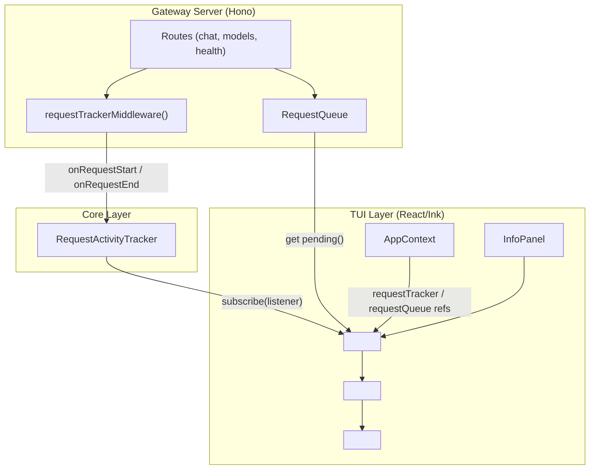
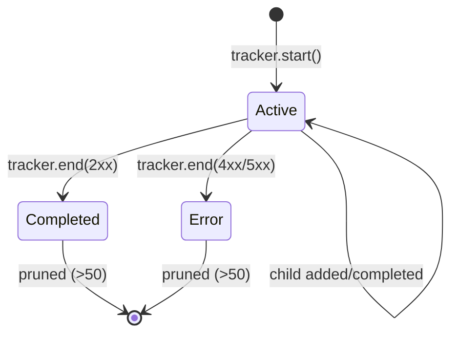

# Design Document: TUI Message Loading (Request Tracker)

## Overview

This feature adds a real-time server activity tracker to the Info Panel, giving developers full visibility into every HTTP request hitting the jh-gateway server. The design introduces three new layers:

1. **RequestActivityTracker** — a pure TypeScript class (no React) that maintains the canonical list of request entries, handles parent/child grouping, enforces the 50-entry retention limit, and exposes state via a subscription model.
2. **Hono middleware** — a lightweight server middleware that emits request lifecycle events (`start` / `end`) into the tracker.
3. **React components** — a `<RequestTracker>` component rendered inside `InfoPanel` that subscribes to the tracker and renders entries with animated spinners, live elapsed timers, and queue depth.

The tracker is wired through `AppContext` so TUI components can read it. The `RequestQueue` already exposes a `get pending()` accessor, so queue depth is read directly — no modifications to `RequestQueue` are needed.

## Architecture



**Data flow:**
1. Every HTTP request passes through `requestTrackerMiddleware` before reaching route handlers.
2. The middleware calls `tracker.start(id, method, path)` on entry and `tracker.end(id, statusCode)` after `await next()`.
3. For chat completions, the route handler calls `tracker.addChild(parentId, childId, label)` when enqueuing work on the `RequestQueue`.
4. The tracker notifies subscribers (the React component) on every state change.
5. The `<RequestTracker>` component re-renders with fresh entries and reads `queue.pending` on each tick.

## Components and Interfaces

### RequestActivityTracker (`src/core/request-activity-tracker.ts`)

Pure TypeScript class — no React dependency. Owns the source of truth for all request entries.

```typescript
export type RequestStatus = "active" | "completed" | "error";

export interface RequestEntry {
  id: string;
  method: string;
  path: string;
  status: RequestStatus;
  statusCode: number | null;
  startTime: number;          // Date.now() at receipt
  endTime: number | null;     // Date.now() at response
  elapsedMs: number | null;   // endTime - startTime (null while active)
  parentId: string | null;    // null for top-level requests
  children: string[];         // child entry IDs (empty for leaf requests)
}

export type TrackerListener = (entries: ReadonlyArray<RequestEntry>) => void;

export class RequestActivityTracker {
  private entries: Map<string, RequestEntry>;
  private orderedIds: string[];          // most-recent-first
  private listeners: Set<TrackerListener>;
  private maxCompleted: number;          // default 50

  constructor(maxCompleted?: number);

  /** Called by middleware when a request arrives. */
  start(id: string, method: string, path: string): void;

  /** Called by middleware when a response is sent. */
  end(id: string, statusCode: number): void;

  /** Called by route handler to register a sub-request under a parent. */
  addChild(parentId: string, childId: string, label: string): void;

  /** Called when a sub-request completes. */
  endChild(childId: string, statusCode: number): void;

  /** Subscribe to state changes. Returns unsubscribe function. */
  subscribe(listener: TrackerListener): () => void;

  /** Get current snapshot of entries (most-recent-first, top-level only). */
  getEntries(): ReadonlyArray<RequestEntry>;

  /** Get children of a specific parent entry. */
  getChildren(parentId: string): ReadonlyArray<RequestEntry>;

  /** Get a single entry by ID. */
  getEntry(id: string): RequestEntry | undefined;

  /** Clear all entries (called on server stop). */
  clear(): void;
}
```

**Key behaviors:**
- `start()` creates an entry with `status: "active"`, `startTime: Date.now()`, pushes to front of `orderedIds`.
- `end()` sets `status`, `statusCode`, `endTime`, computes `elapsedMs`, then prunes completed entries beyond `maxCompleted`.
- `addChild()` creates a child entry linked to the parent via `parentId`, appends child ID to parent's `children` array.
- `endChild()` completes the child. If all children of a parent are done, the parent's status is derived: `"error"` if any child has error status, otherwise `"completed"`.
- Pruning: after each `end()`, count completed top-level entries. If > `maxCompleted`, remove the oldest completed entries (and their children) from both `entries` and `orderedIds`.
- Every mutation calls `notify()` which invokes all listeners with the current entries snapshot.

### Hono Middleware (`src/server.ts` — `requestTrackerMiddleware`)

```typescript
export function requestTrackerMiddleware(tracker: RequestActivityTracker) {
  return async (c: Context, next: Next) => {
    const id = crypto.randomUUID();
    // Store the request ID on the context for route handlers to use
    c.set("requestId", id);
    tracker.start(id, c.req.method, c.req.path);
    try {
      await next();
      tracker.end(id, c.res.status);
    } catch (err) {
      tracker.end(id, 500);
      throw err;
    }
  };
}
```

The middleware is mounted before all routes in `createServer()`. The `requestId` is stored on the Hono context so route handlers (specifically `chatCompletionsRouter`) can call `tracker.addChild(parentId, childId, label)` when enqueuing work.

### Chat Completions Integration

The `chatCompletionsRouter` receives the tracker as a dependency. When it calls `queue.enqueue(task)`, it wraps the call to register a child:

```typescript
const parentId = c.get("requestId");
const childId = crypto.randomUUID();
tracker.addChild(parentId, childId, "queue: sendChatRequest");

const response = await queue.enqueue(async () => {
  try {
    const result = await sendChatRequest(page, credentials, { model, prompt: fullPrompt });
    tracker.endChild(childId, 200);
    return result;
  } catch (err) {
    tracker.endChild(childId, (err as any).statusCode ?? 500);
    throw err;
  }
});
```

For simple routes (models, health), no children are created — the parent entry stands alone.

### AppContext Changes (`src/tui/AppContext.tsx`)

Add two new fields to `TuiAppState`:

```typescript
export interface TuiAppState {
  // ... existing fields ...
  requestTracker: RequestActivityTracker | null;
  requestQueue: RequestQueue | null;
}
```

Add corresponding setters to `AppContextValue`:

```typescript
setRequestTracker: (tracker: RequestActivityTracker | null) => void;
setRequestQueue: (queue: RequestQueue | null) => void;
```

The gateway lifecycle service creates the `RequestActivityTracker` instance and passes it to both `createServer()` and `AppContext`. On gateway stop, both are set to `null`.

### RequestTracker Component (`src/tui/components/RequestTracker.tsx`)

React/Ink component that renders inside `InfoPanel`:

```tsx
export function RequestTracker(): React.ReactElement {
  const { state } = useAppContext();
  const { requestTracker, requestQueue, gatewayStatus } = state;
  // ...
}
```

**Layout (top to bottom):**
1. Section header: `"Server Activity"` (bold)
2. Queue depth line: `"Queue: idle"` / `"Queue: N pending"` / `"Queue: offline"`
3. Fixed-height scrollable container (8 lines) with request entries
4. Idle message when no entries exist

**Scrolling:** Uses Ink's `<Box>` with `height={8}` and `overflowY="hidden"`. Keyboard shortcuts `j`/`k` or `↑`/`↓` scroll the viewport. The scroll offset is managed via `useState`.

**Live elapsed timer:** A `useEffect` with a 200ms `setInterval` forces re-render while any entry is active, computing `Date.now() - entry.startTime` for display.

### RequestEntry Sub-Component

Renders a single row:

```
⠋ POST /v1/chat/completions  3.2s
  ├─ ⠋ queue: sendChatRequest  2.8s
200 GET /v1/models  0.1s
200 GET /health  0.0s
```

- Active entries: spinner frame + method + path + live elapsed
- Completed entries: status code (green for 2xx, red for 4xx/5xx) + method + path + final elapsed
- Children: indented with `├─` prefix

### Spinner Animation

Uses a simple frame array cycled by the parent's interval timer:

```typescript
const SPINNER_FRAMES = ["⠋", "⠙", "⠹", "⠸", "⠼", "⠴", "⠦", "⠧", "⠇", "⠏"];
```

Frame index is derived from `Math.floor(Date.now() / 100) % SPINNER_FRAMES.length` — no per-spinner timer needed. The 200ms re-render interval from the elapsed timer drives the animation at ~5fps (within the 80-200ms requirement).

## Data Models

### RequestEntry (defined above)

Core data structure stored in `RequestActivityTracker.entries` map. Key fields:

| Field | Type | Description |
|-------|------|-------------|
| `id` | `string` | UUID, unique per request |
| `method` | `string` | HTTP method (GET, POST, etc.) |
| `path` | `string` | Request path (/v1/chat/completions, etc.) |
| `status` | `RequestStatus` | `"active"` / `"completed"` / `"error"` |
| `statusCode` | `number \| null` | HTTP status code, null while active |
| `startTime` | `number` | `Date.now()` at request receipt |
| `endTime` | `number \| null` | `Date.now()` at response sent |
| `elapsedMs` | `number \| null` | `endTime - startTime`, null while active |
| `parentId` | `string \| null` | Parent entry ID, null for top-level |
| `children` | `string[]` | Child entry IDs |

### Queue Depth

Read directly from `RequestQueue.pending` (existing getter). No new data model needed.

### State Flow



## Correctness Properties

*A property is a characteristic or behavior that should hold true across all valid executions of a system — essentially, a formal statement about what the system should do. Properties serve as the bridge between human-readable specifications and machine-verifiable correctness guarantees.*

### Property 1: Entry creation preserves request data

*For any* valid HTTP method and path string, calling `tracker.start(id, method, path)` SHALL produce an entry where `entry.method === method`, `entry.path === path`, `entry.status === "active"`, and `entry.startTime` is set to a value within 10ms of `Date.now()` at call time.

**Validates: Requirements 1.1, 1.2, 4.1**

### Property 2: Entry completion stores status and elapsed time

*For any* active request entry, calling `tracker.end(id, statusCode)` SHALL transition the entry to a terminal status (`"completed"` for 2xx, `"error"` otherwise), set `entry.statusCode` to the provided value, and set `entry.elapsedMs` to `entry.endTime - entry.startTime` where `endTime` is within 10ms of `Date.now()` at call time.

**Validates: Requirements 1.4, 2.3, 2.4**

### Property 3: Concurrent active requests are independent

*For any* set of N distinct request IDs (1 ≤ N ≤ 50), starting all N requests SHALL result in N distinct active entries in the tracker, and completing any subset SHALL only affect those specific entries while leaving the others active.

**Validates: Requirements 1.5**

### Property 4: Elapsed time formatting

*For any* non-negative integer millisecond value, the formatting function `formatElapsed(ms)` SHALL produce a string matching the pattern `/^\d+\.\ds$/` where the numeric value equals `Math.round(ms / 100) / 10`.

**Validates: Requirements 4.2, 4.3**

### Property 5: Queue depth formatting

*For any* non-negative integer N, the queue depth display function SHALL produce `"Queue: idle"` when N is 0, and `"Queue: N pending"` (with the literal value of N) when N ≥ 1.

**Validates: Requirements 3.1, 3.3**

### Property 6: Lifecycle events contain required fields

*For any* HTTP request processed by the middleware, the tracker SHALL receive a `start` call containing the request's method and path, and an `end` call containing the response status code, such that the resulting entry contains all four fields (method, path, statusCode, elapsedMs) with non-null values after completion.

**Validates: Requirements 5.1**

### Property 7: Entries ordered most-recent-first

*For any* sequence of N requests started at monotonically increasing times, `tracker.getEntries()` SHALL return entries in reverse chronological order (most recent `startTime` first).

**Validates: Requirements 6.7**

### Property 8: Bounded retention of completed entries

*For any* sequence of N completed top-level requests where N > 50, `tracker.getEntries()` SHALL contain at most 50 completed entries, and those 50 SHALL be the most recently completed ones. Active entries are never pruned regardless of count.

**Validates: Requirements 6.8**

### Property 9: Sub-request grouping

*For any* parent request that spawns K child requests via `addChild()`, `tracker.getChildren(parentId)` SHALL return exactly K entries, each with `parentId` set to the parent's ID. The parent's `children` array SHALL contain exactly those K child IDs.

**Validates: Requirements 7.1**

### Property 10: Parent status derived from children

*For any* parent request with one or more children: (a) while any child has `status === "active"`, the parent SHALL have `status === "active"`; (b) when all children have terminal status and at least one has `status === "error"`, the parent SHALL have `status === "error"`; (c) when all children have `status === "completed"`, the parent SHALL have `status === "completed"` with `elapsedMs` equal to the parent's total wall-clock time (last child endTime minus parent startTime).

**Validates: Requirements 7.3, 7.4, 7.5, 7.7**

## Error Handling

| Scenario | Handling |
|----------|----------|
| Middleware throws before `next()` | `tracker.end(id, 500)` in catch block; entry shows error status |
| Route handler throws | Hono's `onError` handler returns 500; middleware catch records it |
| Request times out (queue overflow) | `RequestQueue` rejects with 429; middleware records 429 status |
| Browser disconnected mid-request | `sendChatRequest` throws 503; recorded as error entry |
| Tracker receives duplicate `start(id)` | Ignored — entry already exists (idempotent) |
| Tracker receives `end(id)` for unknown ID | Ignored — no-op (defensive) |
| Tracker receives `endChild()` for unknown child | Ignored — no-op |
| Gateway stopped while requests active | `tracker.clear()` removes all entries; UI shows offline state |
| Subscriber throws during notification | Caught and logged; other subscribers still notified |

## Testing Strategy

### Property-Based Tests (fast-check)

Each correctness property maps to a single property-based test with ≥100 iterations. The `RequestActivityTracker` is a pure TypeScript class with no I/O dependencies, making it ideal for PBT.

**Test file:** `src/core/request-activity-tracker.test.ts`

| Test | Property | Generators |
|------|----------|------------|
| Entry creation | Property 1 | Random HTTP methods, random URL paths |
| Entry completion | Property 2 | Random status codes (100-599), random active entries |
| Concurrent independence | Property 3 | Random sets of 1-50 UUIDs, random completion subsets |
| Elapsed formatting | Property 4 | Random non-negative integers (0 to 600,000ms) |
| Queue depth formatting | Property 5 | Random non-negative integers (0 to 1000) |
| Lifecycle round-trip | Property 6 | Random method/path/status tuples |
| Ordering | Property 7 | Random sequences of 1-100 requests with increasing timestamps |
| Bounded retention | Property 8 | Random sequences of 1-200 completed requests |
| Child grouping | Property 9 | Random parent with 1-10 children |
| Parent status derivation | Property 10 | Random parent/child configurations with mixed statuses |

**Configuration:**
- Library: `fast-check` (already in devDependencies)
- Minimum iterations: 100 per property
- Tag format: `Feature: tui-message-loading, Property N: <title>`

### Unit Tests (vitest)

Example-based tests for specific scenarios and edge cases:

- Idle state message when tracker is empty (Req 1.6)
- Queue depth displays "Queue: offline" when server not running (Req 3.6)
- Spinner frame array has correct length and characters
- `InfoPanel` renders `RequestTracker` below the connection info box (Req 6.1)
- Standalone entry (no children) renders without grouping (Req 7.6)
- Existing keyboard shortcuts (c, k, b/Esc) still work in InfoPanel (Req 6.9)

### Integration Tests

- Gateway lifecycle: start server → verify tracker is wired to AppContext → stop → verify cleared (Req 5.4, 5.5)
- End-to-end: send HTTP request to running server → verify entry appears in tracker with correct method/path/status
